<h3><code>shivam@github ~ $ ./contributions.sh</code></h3>

  

<h3><code>shivam@github ~ $ whoami</code></h3>
<table>
  <tr>
    <td valign="top"></td>
    <td valign="top"></td>
  </tr>
</table>

  

<h3><code>shivam@github ~ $ ls ./links</code></h3>
<a href="https://www.linkedin.com/in/shivamarora384/">linkedin</a> ·
<a href="https://x.com/arorashivam2004">x</a> ·
<a href="https://leetcode.com/u/Shivu384/">leetcode</a> ·
<a href="https://kaggle.com/shivamarora384">kaggle</a> ·
<a href="https://shivamarora384.netlify.app/">portfolio</a> ·
<a href="mailto:shivamarora382004@gmail.com">email</a>

